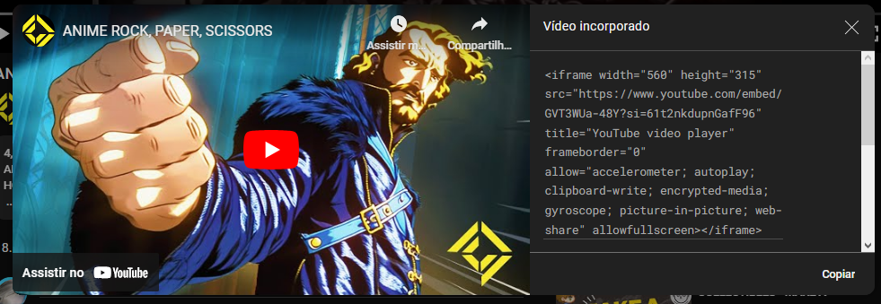

# HTML

# Títulos

<h1>Título (1)</h1>   
<h2>Título (2)</h2>   
<h3>Título (3)</h3>   
<h4>Título (4)</h4>   
<h5>Título (5)</h5>   
<h6>Título (6)</h6>

`<h1>Título (1)</h1>`   
`<h2>Título (2)</h2>`   
`<h3>Título (3)</h3>`   
`<h4>Título (4)</h4>`   
`<h5>Título (5)</h5>`   
`<h6>Título (6)</h6>`

---

### Comentarios

`<!--Comentario-->`  

---

### Parágrafos

<p>Parágrafos aqui</p>  

`<p>Parágrafos aqui</p>`  

> Pode usar lorem para criar textos de prenchimento!!

---

### Itálico

<i>Italico</i>   

`<i>Italico</i>`   
`<em>Italico</em>` - (Semantico)

---

### Negrito

<b>Negrito</b>   

`<b>Negrito</b>`  
`<strong>Negrito</strong>` - (Semantico)

---

### Cortado

<del>Cortado</del>  

`<s>texto taxado</s>` 
`<del>Cortado</del>`- (Semantico)

---

### Outras foramtações por HTML

<mark>Grifado</mark>

`<mark>Grifado</mark> `   

---

<small>Texto pequeno</small>  

`<small>Texto pequeno</small>`

---

<big>Texto Grande</big>  

`<big>Texto Grande</big>`

---

H<sub>2</sub>O  
`H<sub>2</sub>O`

---

x<sup>2</sup>  
`x<sup>2</sup>`

---

### Lista Não Ordenada
<ul>
    <li>Tarefa 1</li>
    <li>Tarefa 2</li>
    <ul>
        <li>Tarefa 2.1</li>
        <li>Tarefa 2.2</li>
    </ul>
    <li>Tarefa 3</li>
</ul>

```
<ul>
    <li>Tarefa 1</li>
    <li>Tarefa 2</li>
    <ul>
        <li>Tarefa 2.1</li>
        <li>Tarefa 2.2</li>
    </ul>
    <li>Tarefa 3</li>
</ul>
```

---

### Lista Ordenada

<ol>
        <li>Tarefa 1</li>
        <li>Tarefa 2</li>
        <ol>
            <li>Tarefa 2.1</li>
            <li>Tarefa 2.2</li>
        </ol>
        <li>Tarefa 3</li>
</ol>

```
<ol>
    <li>Tarefa 1</li>
    <li>Tarefa 2</li>
    <ol>
        <li>Tarefa 2.1</li>
        <li>Tarefa 2.2</li>
    </ol>
    <li>Tarefa 3</li>
</ol>
```

---

### Lista Mista

<ol>
        <li>Tarefa 1</li>
        <li>Tarefa 2</li>
        <ul>
            <li>Tarefa 2.1</li>
            <li>Tarefa 2.2</li>
        </ul>
        <li>Tarefa 3</li>
</ol>

```
<ol>
        <li>Tarefa 1</li>
        <li>Tarefa 2</li>
        <ul>
            <li>Tarefa 2.1</li>
            <li>Tarefa 2.2</li>
        </ul>
        <li>Tarefa 3</li>
</ol> 
```

---

### Citação

<blockquote>
        Lorem ipsum dolor sit amet, consectetur adipisicing elit. Est ipsa aspernatur ratione cumque fugit molestias beatae accusantium quis dicta hic maiores, porro enim eaque laboriosam? Ea placeat sequi quod libero?Lorem ipsum dolor sit amet, consectetur adipisicing elit. Est ipsa aspernatur ratione cumque fugit molestias beatae accusantium quis dicta hic maiores, porro enim eaque laboriosam? Ea placeat sequi quod libero?
</blockquote>  

<p>Citações longas</p>

```
<blockquote>
        Lorem ipsum dolor sit amet, consectetur adipisicing elit. Est ipsa aspernatur ratione cumque fugit molestias beatae accusantium quis dicta hic maiores, porro enim eaque laboriosam? Ea placeat sequi quod libero?Lorem ipsum dolor sit amet, consectetur adipisicing elit. Est ipsa aspernatur ratione cumque fugit molestias beatae accusantium quis dicta hic maiores, porro enim eaque laboriosam? Ea placeat sequi quod libero?
</blockquote>
```

<p><cite>Frase Motivacional Maneira</cite></p>
<p>Citações Curtas</p>

`<p><cite>Frase Motivacional Maneira</cite></p>`

---

### Endereços

<address>
    Escrito por Goiaba<br>
    Nos visite em:<br>
    Rua da Palmeira Rosa, 157<br>
    Paquistão<br>
    Goiaba@gmail.com
</address>

```
<address>
    Escrito por Goiaba<br>
    Nos visite em:<br>
    Rua da Palmeira Rosa, 157<br>
    Paquistão<br>
    Goiaba@gmail.com
</address>
```

---

### Abreviações

<p>O jogo <abbr title="World of Warcraft">WoW</abbr> é muito bom.</p>

`<p>O jogo<abbr title="World of Warcraft">WoW</abbr> é muito bom.</p>`

---

### Links

<p>Meu <a href="https://github.com/Bruno-Petroski">GitHub</a>!!</p>


`<p>Meu <a href="https://github.com/Bruno-Petroski">GitHub</a>!!</p>`

---

### Imagem


<p>Via Arquivo</p>

``

---


<p>Via Link</p>

``

---

### Videos

#### Tag Video

<video width="500" controls autoplay loop>
        <source src="assetsHTML/orange_cat.mp4">
        <source src="">
        <source src="">
</video>

<p>Podem se passar diversos parametros como:</p>

<ul>
    <li><strong>controls</strong> - Para possibilitar o controle do video</li>
    <li><strong>autoplay</strong> - O video inicia sozinho ao abrir o site (ele aparecer na tela)</li>
    <li><strong>loop</strong> - O video se repete</li>
    <li><strong>muted</strong> - Mutar o video</li>
</ul>

<p>Em cada source colocar um formato do mesmo video, para em caso de incompatibilidade haver outras opções</p>

```
<video width="500" controls autoplay loop muted>
        <source src="assetsHTML/orange_cat.mp4">
        <source src="">
        <source src="">
</video>
```

---

#### Iframes do Youtube/Video

<p>É possivel tambem inserir videos do Youtube, basta clicar em compartilhar no video desejado;</p>

<p>Basta clicar em incorporar;</p>

<p>E copiar o código.</p>

> Aparentemente iframe's não é compativel com arquivos md

```
<iframe width="560" height="315" src="https://www.youtube.com/embed/GVT3WUa-48Y?si=61t2nkdupnGafF96" title="YouTube video player" frameborder="0" allow="accelerometer; autoplay; clipboard-write; encrypted-media; gyroscope; picture-in-picture; web-share" allowfullscreen></iframe>
```

---

### Tabelas

<p>Tabelas Menores</p>

```
<tr> 
    <th>Coluna 1</th>  
    <th>Coluna 2</th>  
    <th>Coluna 3</th>  
</tr>
<tr>
    <td>L1 C1</td>  
    <td>L1 C2</td>  
    <td>L1 C3</td>  
</tr>
<tr>
    <td>L2 C1</td>  
    <td>L2 C2</td>  
    <td>L2 C3</td>  
</tr>
<tr>
    <td>L3 C1</td>  
    <td>L3 C2</td>  
    <td>L3 C3</td>  
</tr>
```

---

<p>Tabelas Maiores</p>

```
<thead>
    <th>Coluna 1</th>
    <th>Coluna 2</th>
    <th>Coluna 3</th>
</thead>
<tbody>
    <tr>
        <td>L1 C1</td>
        <td>L1 C2</td>
        <td>L1 C3</td>
    </tr>
    <tr>
        <td>L2 C1</td>
        <td>L2 C2</td>
        <td>L2 C3</td>
    </tr>
    <tr>
        <td>L3 C1</td>
        <td>L3 C2</td>
        <td>L3 C3</td>
    </tr>
</tbody>
<tfoot>
    <tr>
        <td>Rodapé</td>
    </tr>
</tfoot>
```